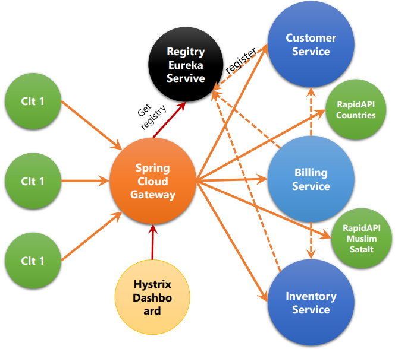

# Microservices 
## Definition
A Microservices' architecture is a way to design applications as a set of independently deployable services. These services should preferably be organized around business skills, automatic deployment, smart ends, and decentralized control of technology and data.
Proposed Architecture
The objective of this work is to show how to create several independently deployable services that communicate with each other, using the facilities offered by Spring Cloud and Spring Boot. Spring Cloud provides tools for developers to quickly and easily build common patterns of distributed systems (such as configuration, discovery, or intelligent routing services). Spring Boot, on the other hand, allows you to build Spring applications quickly as quickly as possible, while minimizing the usually tedious configuration time of Spring applications.
## Our architecture
We will therefore create the following microservices:

* Customer Service: Service that offers a REST API to manage customers.
* InventoryService: Service that offers a REST API to manage products.
* BillingService: Service that offers a REST API to manage billing.
* Gateway Service: single entry point for a collection of microservices.
* Discovery Service: Service allowing the registration of service instances with a view to being discovered by other services.

The resulting architecture will look like this:

## Customer Service
### Dependencies
* Spring Web : Build web, including RESTful, applications using
Spring MVC. Uses Apache Tomcat as the default embedded container.

* Spring Data JPA : Persist data in SQL stores with Java Persistence
API using Spring Data and Hibernate.

* H2 Database : Provides a fast in-memory database that supports JDBC
API and R2DBC access, with a small (2mb) footprint. Supports
embedded and server modes as well as a browser-based console
application.

* Rest Repositories : Exposing Spring Data repositories over REST via
Spring Data REST.

* Lombok : Java annotation library which helps to reduce boilerplate
code.

* Spring Boot DevTools : Provides fast application restarts,
LiveReload, and configurations for enhanced development experience.

* Eureka Discovery Client : a REST based service for locating
services for the purpose of load balancing and failover of middletier servers.

* Spring Boot Actuator : Supports built in (or custom) endpoints that
let you monitor and manage your application - such as application
health, metrics, sessions, etc.

## Inventory Service
### Dependencies

* Spring Web : Build web, including RESTful, applications using
  Spring MVC. Uses Apache Tomcat as the default embedded container.

* Spring Data JPA : Persist data in SQL stores with Java Persistence
  API using Spring Data and Hibernate.

* H2 Database : Provides a fast in-memory database that supports JDBC
  API and R2DBC access, with a small (2mb) footprint. Supports
  embedded and server modes as well as a browser-based console
  application.

* Rest Repositories : Exposing Spring Data repositories over REST via
  Spring Data REST.

* Lombok : Java annotation library which helps to reduce boilerplate
  code.

* Spring Boot DevTools : Provides fast application restarts,
  LiveReload, and configurations for enhanced development experience.

* Eureka Discovery Client : a REST based service for locating
  services for the purpose of load balancing and failover of middletier servers.

* Spring Boot Actuator : Supports built in (or custom) endpoints that
  let you monitor and manage your application - such as application
  health, metrics, sessions, etc.

## Gateway Service
### Dependencies
* Gateway : Provides a simple, yet effective way
to route to APIs and provide cross cutting
concerns to them such as security,
monitoring/metrics, and resiliency.
* Spring Boot Actuator : Supports built in (or
custom) endpoints that let you monitor and
manage your application - such as application
health, metrics, sessions, etc.
* Hystrix : Circuit breaker with Spring Cloud
Netflix Hystrix.
* Eureka Discovery Client : a REST based service
for locating services for the purpose of load
balancing and failover of middle-tier servers.

## Eureka Discovery Service
### Dependencies
* Eureka Server : spring-cloudnetflix Eureka Server

## Billing Service
### Dependencies

* Spring Web : Build web, including RESTful, applications using
  Spring MVC. Uses Apache Tomcat as the default embedded container.

* Spring Data JPA : Persist data in SQL stores with Java Persistence
  API using Spring Data and Hibernate.

* H2 Database : Provides a fast in-memory database that supports JDBC
  API and R2DBC access, with a small (2mb) footprint. Supports
  embedded and server modes as well as a browser-based console
  application.

* Rest Repositories : Exposing Spring Data repositories over REST via
  Spring Data REST.

* Lombok : Java annotation library which helps to reduce boilerplate
  code.

* Spring Boot DevTools : Provides fast application restarts,
  LiveReload, and configurations for enhanced development experience.

* Eureka Discovery Client : a REST based service for locating
  services for the purpose of load balancing and failover of middletier servers.

* Spring Boot Actuator : Supports built in (or custom) endpoints that
  let you monitor and manage your application - such as application
  health, metrics, sessions, etc.
* OpenFeign : Declarative REST Client. OpenFeign creates a dynamic
  implementation of an interface decorated with JAX-RS or Spring MVC
  annotations.
* Spring HATEOAS : Eases the creation of REST full APIs that follow the
  HATEOAS principle when working with Spring / Spring MVC
